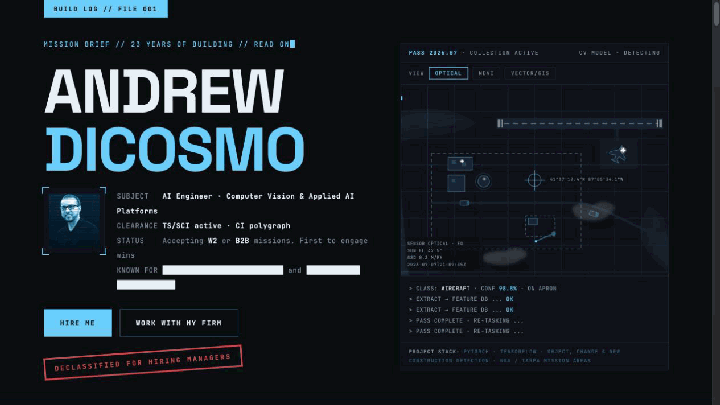
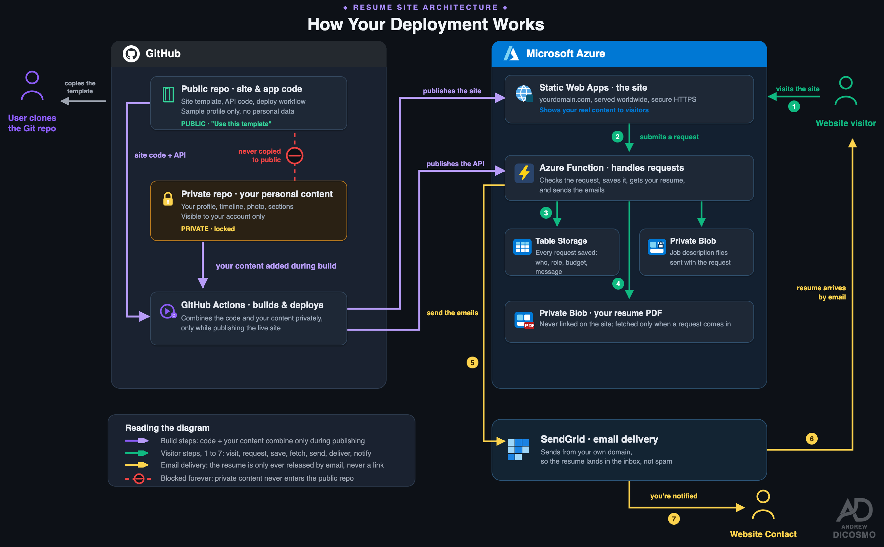

<div align="center">

# Mission Themed Resume Portfolio

A mission-themed resume portfolio you can clone, personalize, and deploy
without placing your career history or contact details in the public code.

<a href="https://andrewdicosmo.com" target="_blank" rel="noopener noreferrer">
  
</a>

[](https://github.com/andrewdicosmo/andrewdicosmo.com/actions/workflows/azure-swa.yml)
[](https://astro.build)
[](https://nodejs.org)
[](https://azure.microsoft.com/products/app-service/static)
[](LICENSE)

<a href="https://andrewdicosmo.com" target="_blank" rel="noopener noreferrer"><strong>View the live site</strong></a> ·
<a href="#make-it-yours-in-15-minutes">Make it yours</a> ·
<a href="#start-the-site-locally">Run it locally</a> ·
<a href="#deploy-your-own-copy">Deploy your copy</a>

</div>

---

This is the public engine behind <a href="https://andrewdicosmo.com" target="_blank" rel="noopener noreferrer">andrewdicosmo.com</a>.
It is designed to be both a polished portfolio and a reusable template: the
public repository contains the design and code, while personal content stays in
a separate private repository.

> **The privacy promise:** someone can clone this repository and run a complete
> example site, but they cannot download your real resume, career history,
> photo, or private copy.

## Make It Yours In 15 Minutes

| Time | What to do | Result |
| --- | --- | --- |
| 5 minutes | Clone the repository and run it locally. | A working example portfolio on your computer. |
| 5 minutes | Replace the example profile, image, and sections. | A portfolio that sounds and looks like you. |
| 5 minutes | Put your real content in a private repository and connect it to deployment. | A public website with private personal data. |

Start with [Start the site locally](#start-the-site-locally). Then use
[Add your own content](#add-your-own-content) and
[Deploy your own copy](#deploy-your-own-copy) when you are ready to publish.

## Deployment Architecture

The diagram shows how the public site, private content, contact form, and resume
delivery work together.

<p align="center">
  
</p>

## What You Get

| Included | Why it matters |
| --- | --- |
| **Mission-themed site engine** | A responsive page layout, styling, and interactions built for a memorable first impression. |
| **Working example content** | The project runs immediately after download, even before you add your own information. |
| **Private-content pattern** | Your public code and personal details are deliberately kept apart. |
| **Contact and resume delivery** | A server-side form endpoint can store leads, accept a job description, and send your resume. |
| **Deployment workflow** | GitHub Actions, GitHub's automated build and deployment service, publishes the site to Azure. |

## Public Code, Private Content

| Public repository | Private repository |
| --- | --- |
| Layout, styles, form code, example content, and deployment workflow. | Your real `data/` folder: profile, career history, image, page copy, and contact settings. |
| Safe for anyone to clone. | Read only by the deployment workflow. |

The real site content is copied into the build only while the website deploys.
The local folder `src/data/` is ignored by Git, the version control system used
by GitHub, so personal details are not saved in the public code history.

## Start The Site Locally

This project is tested with Node.js version 24. You need three tools:

- **Node.js** - the program that runs this project.
- **npm** - Node Package Manager, which installs the project's dependencies. It
  is included with Node.js.
- **Git** - the program that downloads and tracks code from GitHub.

<details>
<summary><b>Mac setup</b></summary>
<br>

1. Install Node.js version 24 from [nodejs.org](https://nodejs.org/).
2. Open the Terminal app.
3. Confirm that Node.js and npm are installed:

```bash
node -v
npm -v
```

4. Check for Git:

```bash
git --version
```

If Git is missing, your Mac may offer to install Apple's command line developer
tools. Accept that prompt.

</details>

<details>
<summary><b>Windows setup</b></summary>
<br>

1. Install Node.js version 24 from [nodejs.org](https://nodejs.org/).
2. Install Git for Windows from [git-scm.com](https://git-scm.com/).
3. Open PowerShell.
4. Confirm that Node.js, npm, and Git are installed:

```powershell
node -v
npm -v
git --version
```

</details>

Then, in Terminal on Mac or PowerShell on Windows:

```bash
git clone https://github.com/andrewdicosmo/andrewdicosmo.com.git
cd andrewdicosmo.com
npm install
npm run dev
```

Open the address shown in the terminal. It is usually:

```text
http://localhost:4321
```

On a new copy, the site automatically copies the public example content from
`content.example/` into the ignored `src/data/` folder. You can explore the
site before entering any personal information.

<details>
<summary><b>Ask ChatGPT or Claude to start it for you</b></summary>
<br>

You can give a coding assistant one of these prompts instead of using the
commands yourself.

Mac prompt:

```text
I am on a Mac. Please help me run this website locally:
https://github.com/andrewdicosmo/andrewdicosmo.com

Check whether Node.js version 24, npm, and Git are installed. If anything is
missing, tell me what to install. Then clone the repository, run npm install,
run npm run dev, and tell me the local website address to open.
```

Windows prompt:

```text
I am on a Windows personal computer. Please help me run this website locally:
https://github.com/andrewdicosmo/andrewdicosmo.com

Use PowerShell. Check whether Node.js version 24, npm, and Git are installed.
If anything is missing, tell me what to install. Then clone the repository, run
npm install, run npm run dev, and tell me the local website address to open.
```

</details>

## Add Your Own Content

Your first customization is simple:

1. Run `npm run dev` once so the example content appears in `src/data/`.
2. Edit the files in `src/data/` on your computer.
3. When you are ready to deploy, copy that folder into a separate **private**
   GitHub repository as `data/` at its top level.
4. Connect that private repository using the deployment steps below.

| File | What you can change |
| --- | --- |
| `profile.json` | Your name, headline, links, company details, and repository link. |
| `timeline.json` | Career timeline entries. |
| `sectors.json` | Industry or focus-area labels. |
| `loadout.json` | Capability cards. |
| `brief.json` | Contact inquiry choices and booking link. |
| `sections/*.html` | Larger page sections and the visible copy. |
| `assets/subject.webp` | Your profile image. |

Files ending in `.json` use JavaScript Object Notation (JSON), a structured text
format. Files ending in `.html` use HyperText Markup Language (HTML), the
standard structure for web pages. Files ending in `.webp` use WebP, an image
format made for websites.

> [!WARNING]
> `src/data/` is intentionally ignored by Git. Do not force-add it or place
> private information in the public repository.

## Deploy Your Own Copy

You need a GitHub account and an Azure account. Azure Static Web Apps is the
hosting service used by this template.

1. Create a separate **private** GitHub repository for your real content. Its
   top-level folder must be `data/`, containing the files you edited locally.
2. Create an Azure Static Web App from your public template repository. The
   included GitHub Actions workflow builds and publishes the site.
3. Add these GitHub Actions secrets to the public template repository:

| Secret | What it is |
| --- | --- |
| `CONTENT_REPO` | Your private repository name, for example `your-name/your-private-content`. |
| `CONTENT_REPO_PAT` | A GitHub Personal Access Token (PAT), a private access key. Give it read-only access to only the private-content repository. |
| `AZURE_STATIC_WEB_APPS_API_TOKEN` | The deployment token supplied by Azure Static Web Apps. |

4. Add the contact-form settings in Azure Static Web Apps. Do not save their
   values in this repository.
5. Push a change to the `main` branch. The workflow copies in the private
   content for that build and publishes the finished site.

## Contact Form And Resume Email

The contact form sends information to an Azure Function, a small server-side
program that runs only when needed. It can store a contact request, save an
uploaded job description, email a resume, notify you, and return a booking link.

Set these values in Azure Static Web Apps, never in this repository:

| Setting | Purpose |
| --- | --- |
| `STORAGE_CONNECTION_STRING` | Connects the function to Azure Storage. |
| `LEADS_TABLE` | The table where contact requests are saved. |
| `ATTACH_CONTAINER` | The container for uploaded job description files. |
| `RESUME_BLOB_URL` | The protected web address of the resume PDF sent to the visitor. |
| `BOOKINGS_URL` | The booking link returned after a complete request. |
| `MAIL_TO` | The address that receives the owner notification. |

Choose one email provider:

| Provider | Required settings |
| --- | --- |
| **Azure Communication Services (recommended)** | `AZURE_COMMUNICATION_CONNECTION_STRING` and `EMAIL_SENDER_ADDRESS`. `MAIL_FROM` may be used if `EMAIL_SENDER_ADDRESS` is not set. |
| **SendGrid (fallback)** | `SENDGRID_API_KEY` and `MAIL_FROM`. |

> [!IMPORTANT]
> Do not put any secret values, access tokens, connection strings, or resume
> download links in this repository.

## Build For Deployment

To create the finished static website files:

```bash
npm run build
```

The finished files are written to `dist/`. Git ignores this folder because the
build command creates it automatically.

## Frequently Asked Questions

### Can I try the site before adding my own information?

Yes. Run the site locally and it will use the included example profile. You can
click through the full design before replacing anything. Start with
[Start the site locally](#start-the-site-locally).

### Will my personal information become public?

Not if you follow the private-content setup. Keep your real `data/` folder in a
separate private GitHub repository and never force-add `src/data/` to the public
repository. See [Public code, private content](#public-code-private-content).

### What can I change without editing the site code?

You can change your name, photo, career history, page copy, contact choices,
booking link, and repository link in `src/data/`. See
[Add your own content](#add-your-own-content) for the file-by-file guide.

### Do I need to be a developer to start?

No. Follow the Mac or Windows steps, or copy one of the included prompts for
ChatGPT or Claude. They can check your setup and start the site for you.

### Will the contact form send emails while I am testing locally?

You can preview the form locally, but saving contacts and sending a resume need
the Azure settings described in [Contact form and resume email](#contact-form-and-resume-email).

### How do I publish my own version?

Create a private repository for your real content, connect your Azure Static
Web App, add the three deployment secrets, and push to `main`. The complete
checklist is in [Deploy your own copy](#deploy-your-own-copy).

### Can I use a host other than Azure?

Yes. Any host that can serve the generated `dist/` folder can host the static
site. The included automated deployment and contact-form instructions are built
for Azure Static Web Apps.

<details>
<summary><b>Useful terms</b></summary>
<br>

| Term | Meaning |
| --- | --- |
| Application Programming Interface (API) | A way for the website to talk to a server-side function. |
| Applicant Tracking System (ATS) | Software companies use to process job applications and resumes. |
| Git | The version control system that tracks file changes over time. |
| GitHub Actions | GitHub's automated build and deployment system. |
| HyperText Markup Language (HTML) | The standard structure for web pages. |
| JavaScript Object Notation (JSON) | A text format for structured data. |
| Personal Access Token (PAT) | A private GitHub key used by automation. |
| Portable Document Format (PDF) | The common file format used for the resume. |
| Static Web App | A website where most files are prebuilt and served directly. |
| Uniform Resource Locator (URL) | A web address. |

</details>

## License

You may use this project under the [MIT License](LICENSE). A visible credit link
to <a href="https://andrewdicosmo.com" target="_blank" rel="noopener noreferrer">andrewdicosmo.com</a>
is appreciated when you publish a site based on this template.

The license covers the public template code and example content in this
repository. It does not grant rights to Andrew DiCosmo's private resume,
private career data, private assets, or deployment secrets.
